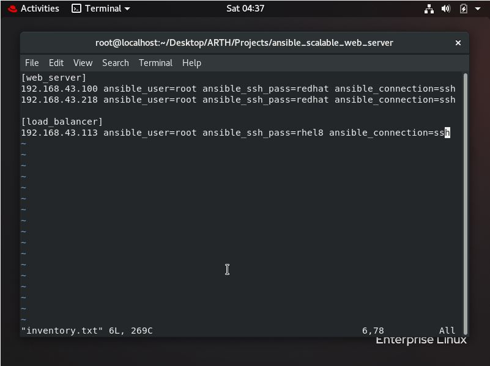
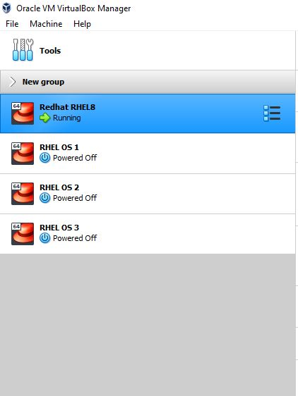
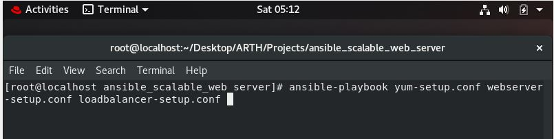
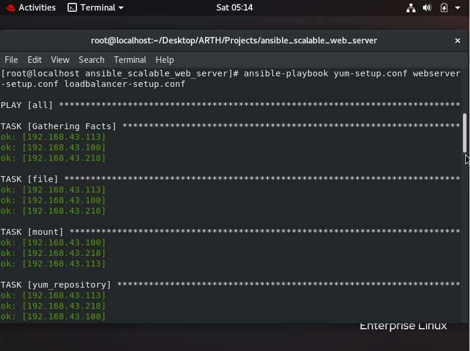
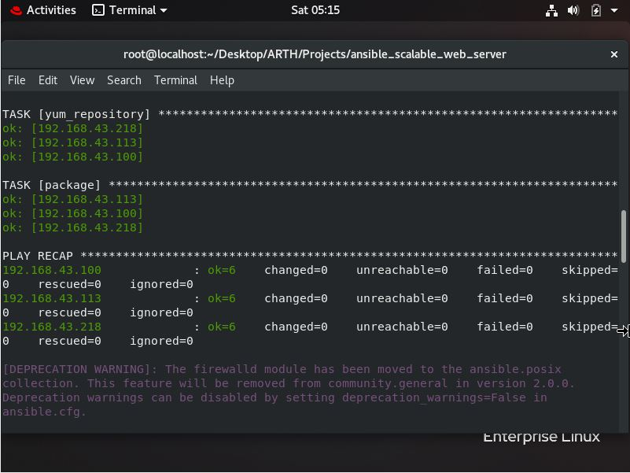
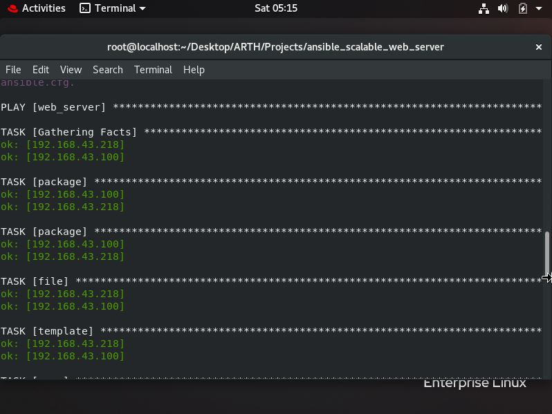
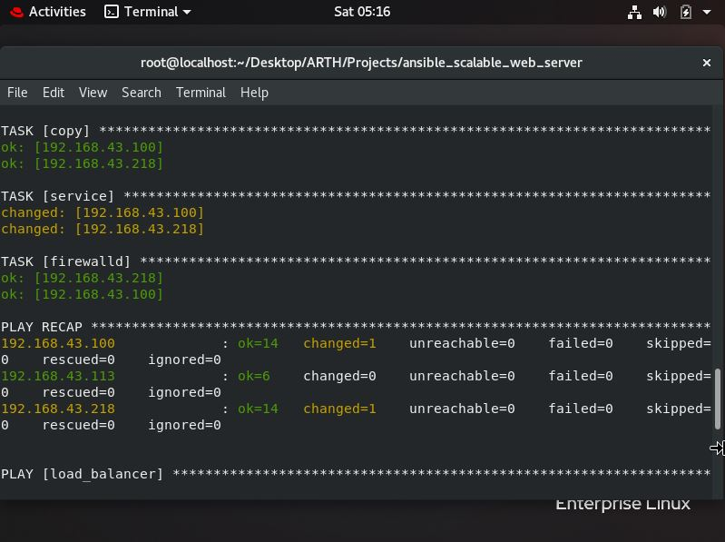
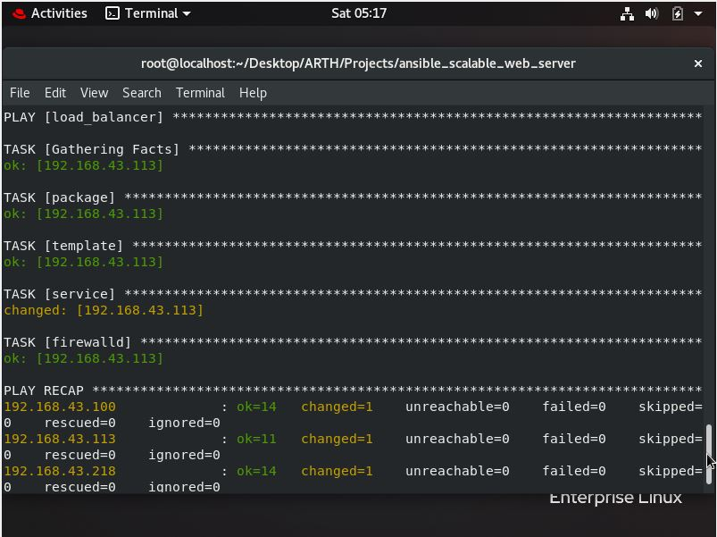
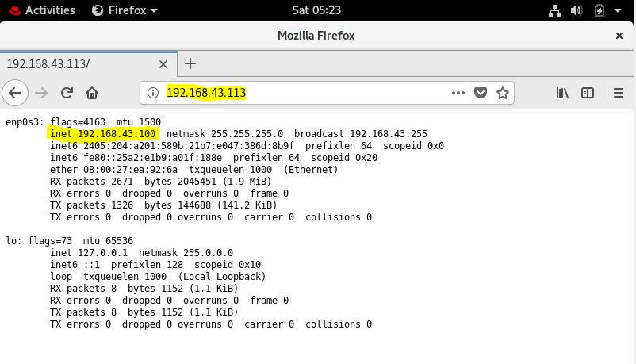
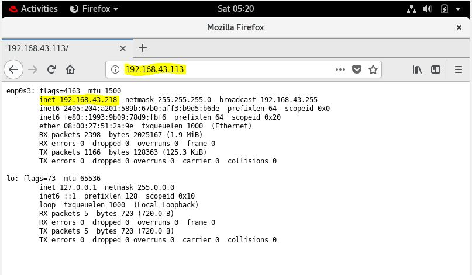

## SCALABLE LOAD BALANCER SETUP USING ANSIBLE AUTOMATION

> This project is an Automation project to setup any web server in an Scalable Environment using Ansible Configuration Management Automation tool.

## Content

* [Overview of the Project](#overview) 
    * [What is it all about?](#what-is-it-all-about)
* [Technical details](#technical-details) 
    * [The tech-stack used in the development of the project](#tech-stack) 
    * [How to download/clone and execute the Project on your machine](#how-to-execute-on-your-machine) 
    * [Glimpse of the project](#glimpse)
    
# Overview

## What is it all about?
This Project is made in order to Deploy the website/webapp with Automation in a Scalable environment using Ansible. Ansible is a Configuration Management tool built in Python language. Using this project we can deploy our application in More than one machines as web servers and use a Load Balancer that also does the Reverse Proxy for us to route the client's requests to one of the backend servers. To do this setup, I have written Automation scripts in Ansible (yaml documents).

# Technical details

## Tech Stack
The tools/technologies used to develop this web applications are 
* Ansible 
* Jinja 
* Html/php
* RedHat Enterprise Linux 8
* Apache WebServer (HTTPD)
* HAProxy server

#### Brief Information
> Ansible has been used to write the Configuration Management and Deployment script.

> Jinja is used for creating templates to dynamically write the scripts according to the webserver IP address and Ansible facts.

> Html/Php is used to just create the webapp in this for the purpose of testing. You can use your Application in its place for Deployment.

> RHEL8 is the Linux Operating System used.

> Apache HTTPD is the webserver used to deploy the webapp.

> HAProxy is the Load Balancer server which does the work of Reverse proxy and load balancing.

## How to execute on your machine

> Follow/Understand the steps to execute/run the project on your machine.

* Download and extract the zip bundle of the project or clone the project using git cloning commands in your Linux machine.


* Download and install python if your system doesn’t have python. It is assumed that you are downloading the project on the python-installed machine.
* Now, you need to install the ansible software, which happens to be the Python library with name ansible.
```python    
pip3 install ansible
```
This downloads the ansible on your system and now we can configure other machines without installing anything on those machines separately as Ansible is an Agentless Management tool.


* After Installing the ansible, you need to tell ansible about the inventory of IP addresses of the machines which you want to configure.
For this, you need to type the following commands, which would create the configuration file for ansible.
Note that in place of `inventory_path` you need to write the path of folder where you downloaded this project.
```python
mkdir /etc/ansible
vim /etc/ansible/ansible.cfg
[defaults]
inventory = inventory_path/inventory.txt
```

* Now, simply run the following command to complete the full setup.	
```python
ansible-playbook yum-setup.conf webserver-setup.conf loadbalancer-setup.conf
```

# Glimpse

This is the inventory file with the IP addresses username and passwords of the machines which I want to configure as WebServer and Load Balancer. You need to edit this file according to your requirements. We do the Scale-out and Scale-in by adding and removing the IP addresses and runing the Setup command of ansible-playbook again.

## Running Command

I will be using Oracle Virtual box to get the Machines (OS) and would be using Redhat RHEL8 as Controller Node, and RHEL OS 1,2,3 as Controller Nodes as shown below:
Note the OS 1 is the Load Balancer and OS 2, 3 are the Webservers.




## Execution status








With this, our setup is finally completed.

Now if we check out our webapp as a client using Mazilla Firefox browser, we will use the url of LoadBalancer IP and would get the webapp reply from Webserver 1, on again refreshing, we get the reply from Webserver 2. This is due to the Round Robin Load Balancing concept which we applied.



